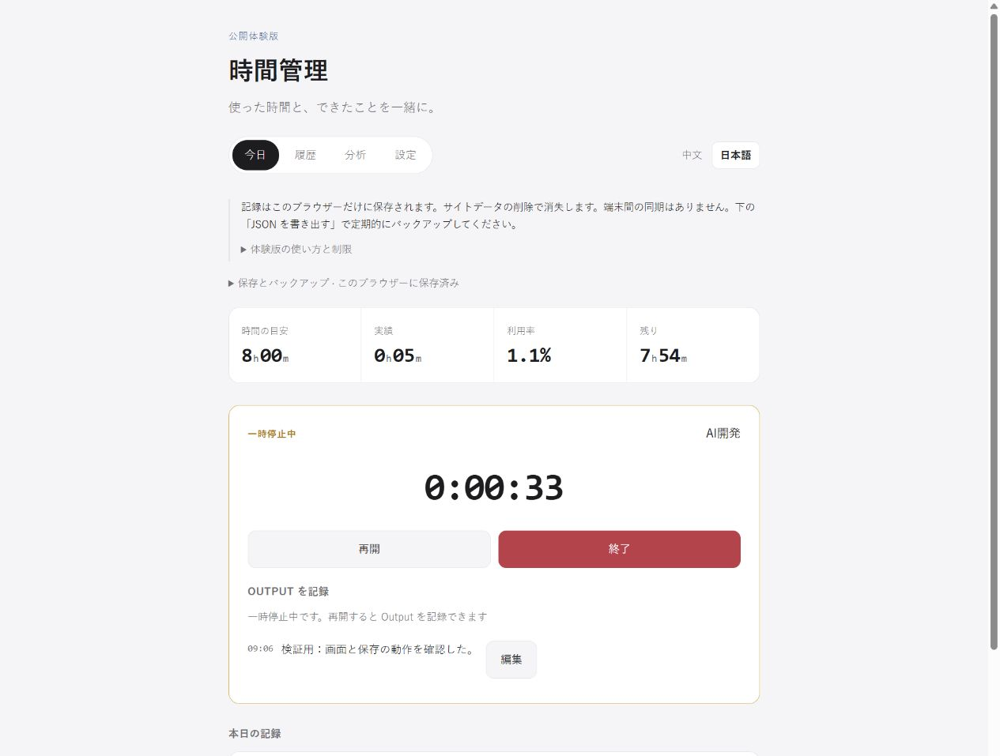
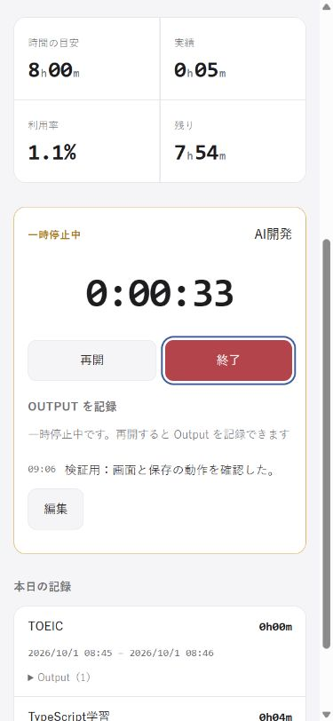

# 时间管理 — 一起记录时间与成果

[日本語](README.md)

这是面向工作、学习、运动的个人时间记录工具。它不仅回答“做了多久”，也让人用一句话记录“做成了什么”。例如学习 TypeScript 后写下“确认了类型差异，完成了一个示例”，就可以把时间与实际成果一起回看。它只记录主动开始的有效活动，不监控全天生活。

当前是已完成功能的**公开体验版**，不是完整 V1。已授权发布到 `wk1499456234-glitch/time-management-showcase` 和 GitHub Pages；当前因等待登录尚未公开，实际链接将在部署验证后填写。目前可本地运行。



## 当前可用

- 4 种固定活动的开始、暂停、恢复、结束；同一时间只能运行一个活动。
- 运行中添加、编辑 Output，结束后从今日记录编辑已有 Output。
- 结束时保存并显示总经过时间、暂停时间、有效时间与 Output 汇总。
- 今日记录、今日有效时间、以固定 8 小时为基准的利用率和剩余时间。
- 浏览器本地保存、刷新恢复、JSON 导出和合并导入。
- 日文、中文 UI 切换；用户输入和导入记录不会被翻译。

历史、分析、设置页面明确显示开发中。活动创建/切换、手动修改时间、周期分析、AI 分析、预算修改均未实现，不作为可用功能演示。

## 完整体验步骤

1. 点击“TypeScript学习”的“开始”，等几秒。
2. 输入“确认了类型差异”，点击“追加”；也可用记录旁的“修改”编辑文字。
3. 点击“暂停”并等待：有效时间保持不变。刷新后仍恢复暂停状态。
4. 点击“恢复”，等一会后“结束”。记录立即保存，展示汇总和今日记录。汇总向下取整到分钟，所以短测试可能显示 0 分钟。
5. 展开今日记录的 Output，编辑文字，再刷新确认保存。
6. 展开“本地数据与备份”，点击“导出 JSON 备份”，把下载文件另存到安全位置。
7. 用“导入 JSON”选择同一个备份，确认合并。同 ID、同内容会跳过；ID 冲突或时间重叠会拒绝整次导入，不覆盖原记录。

运行时关闭页面仍会继续累计时间；中断请暂停，活动完成请结束。



## 技术组成与数据保存

使用 React 18、TypeScript 5、Vite 6 和 CSS，具体版本以 `package-lock.json` 为准。构建只包含静态 HTML/CSS/JavaScript，无需私人 Backend、数据库、模型服务或账号，也没有外部字体和分析 SDK。

`src/state/sessionData.ts` 根据开始、暂停、恢复和结束的时间戳计算有效时间，不把每秒重绘次数作为计时事实。`localSessionStore.ts` 在操作发生时写入 localStorage，通过 Web Locks 和写前比较防止旧标签页覆盖新数据。今日统计按设备本地时区午夜切分并扣除暂停交集，跨日记录的原始事实仍完整保存。

记录仅保存在**访客各自浏览器**，不会发送给作者或其他访客。清除网站数据、关闭隐私模式、更换浏览器/设备/网站地址可能导致记录丢失或不可见，不支持跨设备自动同步。请定期导出 JSON 并保存到另一位置。备份含用户输入的文字，请勿提交到公开仓库。

浏览器禁用存储、容量不足或不支持 Web Locks 时会显示警告。只保存在内存的记录需要在关闭/刷新前立即导出。公开托管需 HTTPS，本地开发可使用 localhost。相同网站的多个标签页共享存储，发生冲突时先导出本页备份，再读取最新数据。

## 开发过程与本人的工作

开发目标是把“同时了解时间投入和实际成果”变成操作负担低的工具。需求中选择只管理工作、学习、运动等有效时间；允许自然语言 Output；不设计统一效率分数；界面保持简约、安静、信息层级清晰。

本人负责需求取舍、界面和操作要求、基于实际使用流程的验收条件、开发与公开范围的决策。本次选择优先展示已经可用的计时、保存和备份，把开发平台排除在展示范围外。实现与验证由 AI 辅助完成，不意味着本人手写了全部代码，也不把 AI 自动执行的验收描述为本人逐项手动操作。

有记录支持的开发过程：

1. **需求**：先明确时间、暂停和 Output 的含义，以及不做哪些功能。
2. **原型**：实现今日统计、活动选择、运行面板和结束汇总。
3. **计时逻辑**：分离状态转换，通过时间戳和暂停区间计算有效时间。
4. **持久化**：从内存原型走到保存当前任务及完成记录，验证刷新、多标签页和 JSON 往返。
5. **公开提取**：将固定 release 的37个文件与来源提交比较，只提取必要源码及测试，补齐日文和手机布局，用隔离记录验收。

开发背景中也存在 AI Agent 开发平台，但本仓库的展示产品只有时间管理软件。

## AI 的工作与真实问题

AI 辅助代码调查、实现、测试编写和运行、问题排查及文档整理。产品需求与公开决策仍由人确定。

| 具体问题 | 解决与证据 |
| --- | --- |
| 内存原型刷新后记录消失 | 保存当前任务、完成记录和暂停区间；`tests/persistence.test.ts` 覆盖运行及暂停恢复。 |
| 多标签页可能用旧状态覆盖新数据 | Web Locks 加写前原文比较，冲突后停止写入并保留内存分支供导出。 |
| JSON 字段顺序被误认为记录冲突 | 来源版已改为规范化结构再比较，本版补充回归测试。 |
| 内嵌浏览器不支持 prompt 编辑 | 来源版改为页内编辑，本次实际执行保存与刷新验证。 |
| 原逻辑会去掉 Output 首尾空白 | 仅用 trim 判断空白输入，保存使用原文；测试覆盖添加、编辑和 JSON 往返。 |
| 日文页面仍出现中文保存错误 | 错误改为翻译键，补齐保存/导入/冲突提示；不翻译记录正文。 |

来源见 [PROVENANCE.md](PROVENANCE.md)，本次实测见 [验证记录](docs/VALIDATION.md)。来源版已有结果与本次执行结果分别说明。

## 学到的 AI 使用方法

比起只说“做一个时间管理软件”，先明确开始、暂停、结束的具体动作和必须保存的事实，更容易检查实现。验收应看刷新、冲突、容量不足的真实结果，而不是只接受“已经完成”的回答。把完整需求与当前实现分开，可以避免把计划中的分析功能写成已完成。

AI 可以承担持续实现和排查，人负责目标、验收标准与公开范围；双方的结果通过代码、测试和差分核对，而不是只靠口头说明。

## 限制与后续计划

活动固定4种、每日基准固定8小时。旧日期记录仍保存并能导出，但没有可选择日期的历史页面。汇总和列表显示分钟，主计时器显示秒。计时依赖设备时钟，向前调整时钟会影响结果。导入限制包括5 MB文本、每列表10,000项等。没有自动同步、账号或 AI 周复盘。

后续候选包括历史浏览与修正、活动/预算设置、周期统计，需要先完善规格与验证；尚未实现。真实 iPhone/Safari 验收也是后续事项。


第一阶段优先使用 GitHub Pages 分享当前静态版。当前没有服务器数据库。第二阶段计划在日本时间 2026 年 10 月 9 日之前完成 Cloudflare 公开运行、服务器记录保存/读取、Output 更新、访客数据隔离及安全与功能验收；这些尚未实现，也不是当前静态版的发布前置条件。

## 本地运行与构建

准备 Node.js 22 以上及 npm，在本目录执行：

```sh
npm ci
npm run dev -- --host 127.0.0.1
```

`npm ci` 按锁文件安装依赖；`dev` 启动开发服务器，打开终端显示的网址即可。

```sh
npm run typecheck
npm test
npm run build
npm run check:public
npm run preview -- --host 127.0.0.1 --port 5196 --strictPort
```

依次用于类型检查、计时/保存回归测试、生成 `dist/`、检查公开文件和构建内容、预览生产构建。不要直接双击 HTML，应通过 HTTP 服务器访问。开发和预览端口不同，浏览器记录也相互独立。

发布步骤见 [DEPLOYMENT.md](DEPLOYMENT.md)，拟公开清单见 [PUBLIC-FILES.txt](PUBLIC-FILES.txt)。当前尚未上传或部署。
